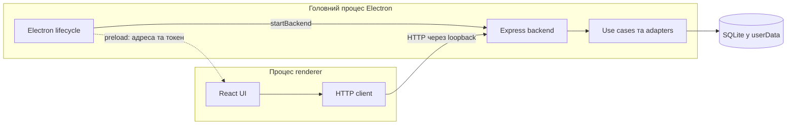
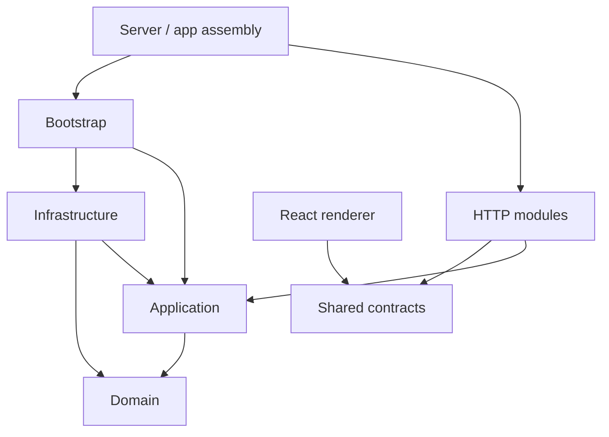
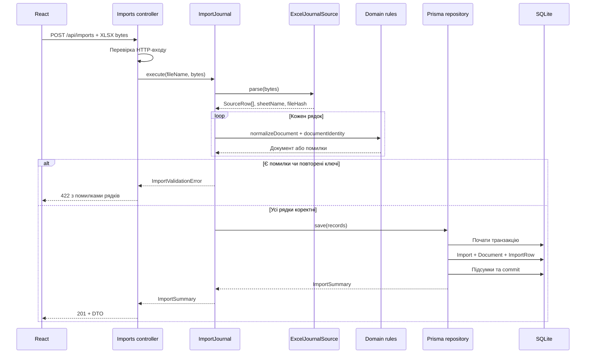
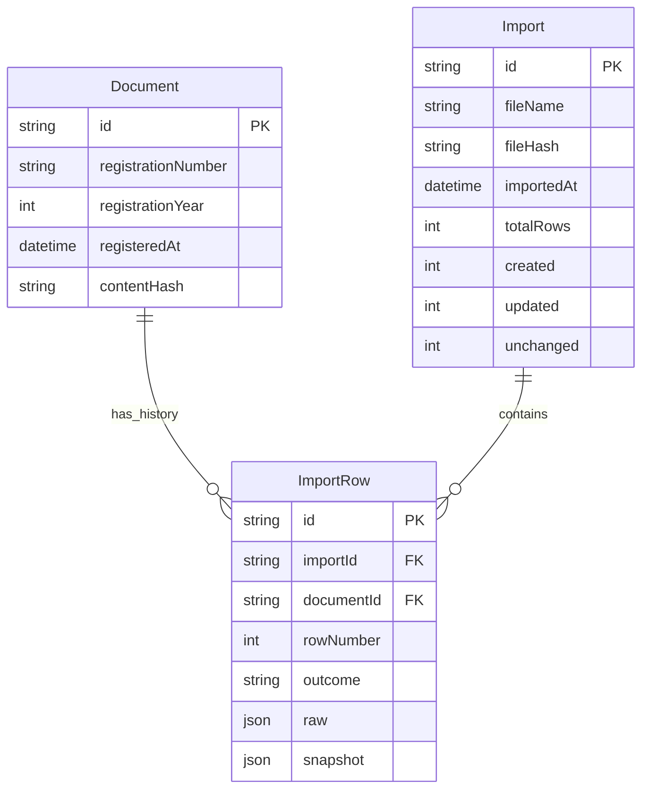

# Архітектура ASKOD Reports

Цей документ описує поточну реалізацію та правила її розвитку. Він відповідає на
питання: де розташувати новий код, як проходить запит, хто зберігає дані й що
потрібно змінювати при переході від desktop до вебзастосунку.

Команди запуску наведено в [README](../README.md), HTTP endpoints і env —
у [документації backend](../apps/backend/README.md), порядок внесення змін —
у [посібнику розробника](development.md).

## 1. Архітектурний підхід

Backend — **модульний моноліт із шарами**: один серверний застосунок, розділений
на функціональні HTTP-модулі та внутрішні шари domain/application/infrastructure.
Окрема функціональність, наприклад імпорт, не потребує нового сервісу чи npm-пакета.

Підхід використовує принципи Clean / Hexagonal Architecture:

- бізнес-сценарії не залежать від HTTP, Electron, ORM або формату файла;
- сценарій описує потрібну залежність інтерфейсом;
- infrastructure надає реалізацію інтерфейсу;
- bootstrap створює конкретні реалізації й передає їх сценаріям.

**Інверсія залежностей** означає, що `ImportJournal` знає інтерфейс `JournalRepository`,
але не знає Prisma. Prisma-реалізація залежить від цього інтерфейсу, а не навпаки.
Під час виконання сценарій викликає реалізацію, яку отримав у конструкторі.

### Чому саме така структура

| Рішення                                    | Причина та наслідок                                                                            |
| ------------------------------------------ | ---------------------------------------------------------------------------------------------- |
| Серверні шари всередині `backend`          | Вони використовуються одним сервером; окремі workspace-пакети не потрібні для збереження меж   |
| `infrastructure`, а не загальна `services` | Назва відокремлює технічні adapters від бізнес-сценаріїв                                       |
| `application/use-cases`                    | Кожен сценарій має явну точку входу: імпорт, список документів, історія                        |
| `application/interfaces`                   | Залежності можна підміняти в тестах або замінювати іншими технологіями                         |
| HTTP між renderer і backend                | Клієнт використовує той самий спосіб взаємодії з локальним і майбутнім віддаленим сервером     |
| Один `shared` пакет                        | Клієнт і сервер узгоджують HTTP-контракти, не ділячись серверними реалізаціями                 |
| SQLite на старті                           | Локальне сховище без окремого сервера БД; перехід на PostgreSQL потребує інфраструктурних змін |

## 2. Застосунки та процеси

```text
apps/
  backend/          сервер, бізнес-логіка, adapters, Prisma та серверні тести
  desktop/          Electron main, preload і React renderer
packages/
  shared/           браузерні HTTP-контракти та Zod-схеми
```

`@askod/backend`, `@askod/desktop` та `@askod/shared` — приватні npm workspaces.
Внутрішні шари backend — звичайні TypeScript-модулі, а не окремі npm-пакети.

### Desktop-режим



**Express зараз працює в головному процесі Electron**, а не в окремому серверному
процесі. Окремий дочірній процес запускається для Prisma CLI під час міграцій.
ExcelJS-парсинг також виконується в основному серверному процесі; окремих workers
або фонової черги імпорту наразі немає.

Renderer вибирає файл через браузерний input і передає його байти HTTP-запитом.
Доступ до файлової системи, Prisma та Electron internals йому не надається.

### Standalone-режим

`main.ts` запускає Express в окремому Node-процесі. Electron для цього не потрібен.
Сценарії, routes, controllers і repository залишаються тими самими.

Desktop за замовчуванням використовує `app.getPath('userData')/askod.db`.
Standalone використовує `<workspace>/.data/askod.db` або `DATABASE_URL`.
Це **різні бази за замовчуванням**; спільне сховище потребує явного налаштування.

## 3. Карта backend

```text
apps/backend/
  src/
    domain/
      documents/                 моделі, нормалізація, ключ документа
      imports/                   початкові рядки та помилки валідації
    application/
      interfaces/                контракти джерел і сховищ
      models/                    результати сценаріїв та записи імпорту
      use-cases/
        documents/
        imports/
        workspace/
    infrastructure/
      database/
        connect-database.ts      Prisma connection і запуск міграцій
        repositories/            збереження та запити
        mappers/                 Prisma ↔ domain
      excel/                     XLSX reader і зіставлення колонок
    modules/
      documents/                 HTTP routes та controller
      imports/                   HTTP routes та controllers
      workspace/                 HTTP routes та controller
    http/
      middleware/                доступ, 404, обробка помилок
      errors/                    HTTP-помилки
      validation/                перевірка параметрів запиту
    bootstrap/                   створення залежностей, обробка сигналів
    config/                      типи, валідація налаштувань, читання env
    app.ts                       складання Express без порту й БД
    server.ts                    HTTP lifecycle та закриття ресурсів
    main.ts                      entrypoint окремого Node-процесу
    index.ts                     публічний startBackend для Electron
  prisma/
    schema.prisma
    migrations/
  tests/
```

## 4. Відповідальність і межі шарів

### Domain: що означають дані

Domain містить моделі, нормалізацію та правила ідентифікації документа.

- `JournalDocument` — нормалізовані змістові поля документа.
- `Document` — ті самі поля з технічним `id`.
- `SourceRow` — значення рядка, його номер та початкові дані.
- `normalizeDocument` — обов’язкові поля, текст, числа й календарні дати.
- `documentIdentity` — ключ «номер документа + рік реєстрації».
- `ImportValidationError` — помилки даних із номером рядка й назвою поля.

Domain працює зі звичайними TypeScript-значеннями. Він не читає Excel, не виконує
SQL, не знає HTTP status codes і не читає змінні середовища.

Джерела: [модель документа](../apps/backend/src/domain/documents/document.ts),
[нормалізація](../apps/backend/src/domain/documents/normalize-document.ts),
[ключ документа](../apps/backend/src/domain/documents/document-identity.ts).

### Application: що потрібно зробити

Use case організовує послідовність операцій, використовуючи domain та інтерфейси залежностей.

| Сценарій             | Дія                                                                | Потрібна залежність                             |
| -------------------- | ------------------------------------------------------------------ | ----------------------------------------------- |
| `ImportJournal`      | Прочитати джерело, перевірити всі рядки, виявити повтори, зберегти | `JournalSource.parse`, `JournalRepository.save` |
| `ListDocuments`      | Отримати сторінку документів                                       | `JournalRepository.list`                        |
| `ListImports`        | Отримати останні імпорти                                           | `JournalRepository.recentImports`               |
| `GetWorkspaceStatus` | Отримати кількість документів                                      | `DocumentRepository.count`                      |

Інтерфейс визначає очікувану поведінку, а не конкретну бібліотеку:

```ts
interface JournalSource {
  parse(bytes: Uint8Array): Promise<{
    rows: SourceRow[];
    sheetName: string;
    fileHash: string;
  }>;
}
```

`JournalRepository` об’єднує запис і читання журналу. Окремі use cases приймають лише
потрібну частину цього інтерфейсу через `Pick`, наприклад `Pick<JournalRepository, 'save'>`.
`ImportSummary` — результат сценарію, `ImportRecord` — документ разом із початковим рядком.

У цих модулях немає Express, Prisma чи ExcelJS. Поточний вхід `ImportJournal`
усе ще орієнтований на файл: `fileName` і `bytes`; це важливо для майбутньої ASKOD API-інтеграції.

Джерела: [ImportJournal](../apps/backend/src/application/use-cases/imports/import-journal.ts),
[інтерфейс джерела](../apps/backend/src/application/interfaces/journal-source.ts),
[інтерфейс сховища](../apps/backend/src/application/interfaces/journal-repository.ts).

### Infrastructure: як працюють конкретні технології

Неймінг: `JournalRepository` — інтерфейс application; `createPrismaJournalRepository`
— фабрика його Prisma-реалізації у файлі `prisma-journal.repository.ts`.
Репозиторій охоплює документи та історію імпорту, які зберігаються разом у транзакції.

- `ExcelJournalSource` перевіряє XLSX-архів, читає його через ExcelJS і зіставляє
  українські заголовки з полями `SourceRow`. Знання формату АСКОД живе тут.
- `connectDatabase` створює Prisma Client, відкриває БД, запускає committed migrations
  через `prisma migrate deploy` і повертає repository та функцію закриття.
- `createPrismaJournalRepository` виконує запити, порівнює поточний знімок із новим,
  створює/оновлює записи та зберігає історію в транзакції.
- `document-mapper` перетворює domain-дати на `Date` для Prisma та повертає їх
  у формат `YYYY-MM-DD` при читанні. Тут також обчислюється `registrationYear`.

Рішення `created / updated / unchanged` та обчислення `contentHash` зараз реалізовані
в repository. За появи складніших правил вирішення конфліктів їх слід оформити
окремою application/domain-політикою, залишивши транзакційний запис у repository.

Prisma-моделі не повертаються з infrastructure напряму. Це дозволяє змінювати
схему зберігання без поширення ORM-типів на сценарії та клієнт.

Джерела: [Excel adapter](../apps/backend/src/infrastructure/excel/excel-journal-source.ts),
[repository](../apps/backend/src/infrastructure/database/repositories/prisma-journal.repository.ts),
[mapper](../apps/backend/src/infrastructure/database/mappers/document-mapper.ts).

### HTTP-модулі: як прийняти й повернути дані

`modules/<feature>` групує routes і controllers за функціональністю. Це HTTP-модулі;
відповідна бізнес-логіка розташована в application/domain.

- Route визначає метод, шлях і middleware, наприклад парсер тіла XLSX-запиту.
- Controller перевіряє вхід, викликає use case і формує HTTP-відповідь.
- Спільний `http/` містить обробку доступу, валідацію запитів, 404 та помилки.

Контролери отримують залежності з `BackendDependencies`; їх можна замінити простими
об’єктами з методом `execute` у тестах. Контролер не створює Prisma Client або reader Excel.

### Bootstrap: хто з’єднує частини

[createDependencies](../apps/backend/src/bootstrap/create-dependencies.ts) — місце
створення конкретних залежностей. Воно відкриває сховище, створює Excel adapter,
передає їх use cases та повертає `BackendResources`:

```text
BackendResources
  dependencies    use cases та функція перекладу назв полів для HTTP
  close()         звільнення ресурсів БД
```

Наприклад, `new ImportJournal(new ExcelJournalSource(), database.journal)` зв’язує
інтерфейси application з реалізаціями infrastructure. Окремий DI-фреймворк для цього не використовується.

### Shared: що бачить клієнт

`packages/shared/src/contracts` містить Zod-схеми й HTTP DTO. DTO — форма даних
на межі клієнта й сервера, яка може відрізнятися від повної domain-моделі.
Наприклад, відповідь списку документів містить лише поля для таблиці, хоча БД
зберігає всі реквізити. Відсутність поля в DTO не означає, що його втрачено при імпорті.

Shared не є місцем для repository, domain-моделей backend, бізнес-сценаріїв,
Electron або Node API. Джерело: [спільні контракти](../packages/shared/README.md).

### Напрям залежностей коду

У цій схемі стрілка означає **«імпортує / залежить від»**, а не порядок виконання запиту.



| Частина                   | Дозволена основна залежність                             | Чого тут бути не повинно                  |
| ------------------------- | -------------------------------------------------------- | ----------------------------------------- |
| Domain                    | Domain                                                   | ORM, HTTP, Electron, файлової системи     |
| Application               | Application, Domain                                      | Конкретних adapters, env, Express         |
| Infrastructure            | Infrastructure, Application, Domain, технічні бібліотеки | React UI, HTTP controllers                |
| HTTP modules / middleware | Application types, Domain errors, Shared, HTTP utilities | Створення БД, читання env, запуск сервера |
| Bootstrap                 | Конкретні use cases та adapters                          | Правил обробки документів                 |
| Renderer                  | Власний код, React, Shared                               | Backend imports, Prisma, Node API         |
| Shared                    | Shared, Zod                                              | Серверних реалізацій                      |

Внутрішні імпорти backend — відносні. `index.ts` шарів лише експортують код.
Публічний `@askod/backend` використовується Electron main, а не renderer.

## 5. Шлях HTTP-запиту

[app.ts](../apps/backend/src/app.ts) підключає middleware в такому порядку:

1. `accessControl`: origin, CORS preflight, bearer token, заголовок `Cache-Control`.
2. Routes `/api/workspace`, `/api/documents`, `/api/imports`.
3. `notFound`: якщо жоден маршрут не відповідає запиту.
4. `errorHandler`: перетворення помилок на HTTP-відповідь.

Для списку документів шлях короткий:

```text
GET /api/documents?page=1&pageSize=25
  → documents route
  → controller: parseRequest(paginationSchema)
  → ListDocuments.execute
  → JournalRepository.list: count + page query
  → mapper: Prisma → domain
  → documentsSchema: формування DTO
  → React table
```

Логіка пагінації в repository використовує `skip/take`; сортування — дата реєстрації
за спаданням, номер та ID за зростанням. Кількість і сторінка читаються в транзакції.

## 6. Імпорт: валідація та транзакція



Помилка самого XLSX може зупинити процес ще під час `Source.parse`, до нормалізації.
Ліміти: 10 МіБ файла, 50 МіБ сумарного заявленого розпакованого розміру ZIP entries,
1000 ZIP entries, 10 000 рядків після заголовка та 100 позицій колонок аркуша.
Очікуються 43 відомі заголовки; порожні проміжні рядки також входять у ліміт рядків.
Непідтримувані заголовки, формули та Excel errors відхиляються.

Валідація всіх документів відбувається **до першого запису в БД**. Use case також
відхиляє повтор ключа всередині одного файла, щоб порядок рядків не визначав результат.
Повертається до 100 помилок нормалізації/повторів; структурні помилки файла можуть повертатися першими.

Repository в одній транзакції:

1. Створює `Import` із метаданими файла.
2. Шукає кожен документ за номером і роком.
3. Обчислює SHA-256 нормалізованого документа та визначає результат зміни.
4. Створює або оновлює `Document`, якщо потрібно.
5. Завжди створює `ImportRow` зі знімком і початковими значеннями.
6. Оновлює підсумки `Import` та завершує транзакцію.

Помилка збереження відкочує також попередні рядки й запис історії цього імпорту.
Успішні імпорти мають історію; невдалі спроби зараз не зберігаються окремими подіями.
Для Prisma-транзакції задано `timeout: 60_000` і `maxWait: 10_000`.

## 7. Модель зберігання та повторні імпорти



Діаграма показує основні зв’язки й службові поля; повні реквізити визначає
[Prisma schema](../apps/backend/prisma/schema.prisma).

| Сутність    | Призначення                                                                        |
| ----------- | ---------------------------------------------------------------------------------- |
| `Document`  | Актуальні значення 42 змістових колонок, технічний ID, рік і hash                  |
| `Import`    | Ім’я, SHA-256 файла, аркуш, час і лічильники успішного імпорту                     |
| `ImportRow` | Номер Excel-рядка, результат зміни, 43 початкові значення та нормалізований знімок |

Обмеження БД: унікальні `(registrationNumber, registrationYear)` і `(importId, rowNumber)`.
`ImportRow` має обов’язкові зв’язки з документом та імпортом; їх видалення обмежене `Restrict`.
`№ з/п` зберігається в `raw` і не входить до бізнес-ключа чи content hash.

### Приклади ідентифікації

| Наявний документ    | Новий рядок                          | Результат                             |
| ------------------- | ------------------------------------ | ------------------------------------- |
| `Т-001`, 15.09.2026 | `Т-001`, 15.09.2026, змінений зміст  | Оновити той самий документ            |
| `Т-001`, 15.09.2026 | `Т-001`, 01.08.2026                  | Оновити дату в тому самому документі  |
| `Т-001`, 15.09.2026 | `Т-001`, 15.09.2027                  | Створити окремий документ             |
| `Т-001`, 15.09.2026 | Повністю однакові нормалізовані дані | Документ без змін, нова подія імпорту |

Організація не входить у ключ. Номер обрізається по краях, але регістр і символи
автоматично не уніфікуються. Зміна номера або року не переносить історію старого
документа — створюється новий ключ.

`fileHash` служить для походження даних, а не як заборона повторного завантаження.
Навіть однаковий файл додає нову історію. `contentHash` визначає зміни конкретного
нормалізованого документа. Старіші експорти не визначаються автоматично: останній
успішний імпорт за тим самим ключем стає актуальним значенням.
Документи, відсутні в новому файлі, не видаляються.

### Типи й початкові значення

- Domain-дати — календарні рядки `YYYY-MM-DD`; Prisma зберігає їх як `DateTime` з UTC-північчю.
- Порожні необов’язкові поля стають `null`; нуль залишається нулем.
- Телефони, коди й номери — текст. Контактні реквізити не виправляються автоматично.
- `raw` зберігає інтерпретовані значення комірок: дати можуть бути ISO-рядками,
  rich text зводиться до тексту. Це не побайтова копія XLSX; стилі, формули й файл не архівуються.
- `snapshot` дозволяє відновити зміст документа для конкретного успішного імпорту.
  Інтерфейс перегляду окремих історичних знімків ще не реалізовано.

## 8. Запуск, ресурси та завершення

| Файл                    | Роль                                                                                |
| ----------------------- | ----------------------------------------------------------------------------------- |
| `index.ts`              | Експортує `startBackend`, не запускає сервер при імпорті                            |
| `main.ts`               | Читає конфігурацію standalone, готує типовий каталог, запускає сервер і сигнали     |
| `config/environment.ts` | Перетворює env у параметри; не читає env при імпорті модуля                         |
| `server.ts`             | Перевіряє параметри, створює залежності, відкриває порт, повертає `url` і `close()` |
| `app.ts`                | Створює Express із переданих залежностей, без БД й порту                            |
| `bootstrap/shutdown.ts` | Обробляє SIGINT/SIGTERM лише для окремого Node-процесу                              |

До відкриття HTTP-порту `connectDatabase` відкриває SQLite-файл та застосовує
міграції з `apps/backend/prisma/migrations`. Перенесення папки без зміни файлів
не змінює ідентичність міграцій. При помилці зайнятого порту ресурси БД закриваються.

`close()` повертає ту саму Promise при повторному виклику. Сервер припиняє приймати
нові з’єднання, дає активним до 10 секунд, потім примусово закриває з’єднання й
звільняє БД. Це не окремий протокол гарантованого завершення довгих фонових задач.
Standalone має додатковий 15-секундний deadline завершення процесу.

У desktop-режимі Electron викликає `close()` зі свого lifecycle. На macOS закриття
останнього вікна не завершує застосунок; backend працює до виходу з програми.

## 9. Валідація, помилки та межа доступу

Валідація має кілька власників:

| Рівень          | Що перевіряє                                             |
| --------------- | -------------------------------------------------------- |
| HTTP / Zod      | Параметри запиту, ім’я файла, пагінацію, форму відповіді |
| Excel adapter   | ZIP/XLSX, аркуш, заголовки, підтримувані типи комірок    |
| Domain          | Обов’язкові поля, числа, дати, нормалізацію              |
| Use case        | Порожній імпорт, повторені ключі в одному файлі          |
| Repository / БД | Атомарність, унікальні ключі, зовнішні зв’язки           |

`parseRequest` перетворює неправильний HTTP-вхід на `400`. Порушення схеми
**відповіді** — `500`, бо це помилка сервера. `ImportValidationError` стає `422`;
назви полів перекладаються через передану bootstrap-функцію `importFieldLabel`.
Внутрішні повідомлення Prisma не надсилаються клієнту.

У desktop застосовано `contextIsolation`, sandbox і вимкнено `nodeIntegration`.
Preload відкриває лише `getRuntimeConfig`; main перевіряє відправника IPC.
Backend слухає loopback, перевіряє origin і випадковий bearer token сесії.
Для file-based renderer очікуваний origin — `null`, у dev — origin Vite.
CSP дозволяє inline React Refresh preamble лише у dev HTML.

Це захист локальної доставки, а не багатокористувацька автентифікація.
Standalone за замовчуванням слухає loopback, а `API_TOKEN` необов’язковий.
Відсутність Origin у запиті сама по собі не блокується; CORS не замінює авторизацію.

## 10. Як архітектура перевіряється

[Архітектурні тести](../apps/backend/tests/architecture/boundaries.test.ts) перевіряють
статичні import/export та літеральні dynamic import/require:

- domain/application залежать лише від дозволених внутрішніх шарів;
- конкретна infrastructure доступна з bootstrap, але не з HTTP-модулів;
- renderer і shared не імпортують серверні реалізації.

Це перевірка імпортів, а не повний аналіз будь-якого виконуваного коду. Дотримання
меж при читанні глобального стану чи додаванні бізнес-правил також потребує review.

HTTP-тести підміняють use cases без БД. Інтеграційні тести використовують синтетичні
XLSX і тимчасові SQLite-бази: перевіряють мапінг, повтори, оновлення, історію,
відкат транзакції та номер+рік. Runtime-тести перевіряють порти й закриття ресурсів.
Electron smoke test підтверджує реальний зв’язок renderer → HTTP → SQLite та відсутність Node globals.

## 11. Розвиток і поточні обмеження

| Напрям                      | Що потрібно змінити                                                                        | Що можна повторно використати                        |
| --------------------------- | ------------------------------------------------------------------------------------------ | ---------------------------------------------------- |
| PostgreSQL                  | Prisma provider, database config, SQL migrations, перенесення даних і перевірка repository | Domain, сценарії, HTTP-контракти                     |
| Віддалений backend / web    | Доставка renderer, runtime config, auth, CORS, HTTPS, deployment                           | HTTP-модулі та бізнес-сценарії                       |
| ASKOD REST API              | HTTP adapter, отримання credentials, вхід сценарію й контракт джерела                      | Нормалізацію, ідентифікацію, транзакційне збереження |
| Predefined reports          | Моделі, use cases, запити й новий HTTP-модуль                                              | Нормалізовані збережені документи                    |
| Excel/PDF export            | Інтерфейс експорту й конкретні adapters                                                    | Результат сценарію формування звіту                  |
| Багатокористувацькі імпорти | Чергу/обмеження паралельності, retries, правила конфліктів і аудит користувачів            | Наявні перевірки та історію рядків                   |

Поточний `JournalSource.parse(bytes)` містить файлові поняття `sheetName` і `fileHash`.
Для pull-інтеграції з ASKOD API потрібно адаптувати цей контракт або додати окремий
сценарій отримання даних; проста заміна ExcelJS-класу не реалізує весь workflow.

Зараз немає workers, черги імпортів, автоматичного retry конфліктів чи координації
між кількома серверними процесами. Ліміти XLSX обмежують вхід, але не забезпечують
ізоляцію CPU-навантаження від Electron main. Перенесення сервера/парсера в окремий
процес може стати наступним кроком за потреби великих файлів.

Зібрані артефакти запускаються з checkout та встановленими залежностями.
Інсталятор desktop, підпис, автооновлення, production image й постачання Prisma CLI/engines
потребують окремого налаштування. Авторизація користувачів, звіти та PDF поки є планами.

## 12. Як знайти місце для зміни

- Нове правило значення або ідентичності документа → `domain`.
- Новий сценарій роботи → `application/use-cases`.
- Новий спосіб читання/збереження → інтерфейс application та adapter infrastructure.
- Новий HTTP endpoint → `modules`, shared contract і реєстрація в `app.ts`.
- Заміна конкретної реалізації залежності → `bootstrap`.
- Налаштування запуску → `config`, `main.ts` або `server.ts`.
- Зміна того, що бачить користувач → renderer; HTTP DTO за потреби — shared.

Покрокові приклади й команди перевірки: [посібник розробника](development.md).
